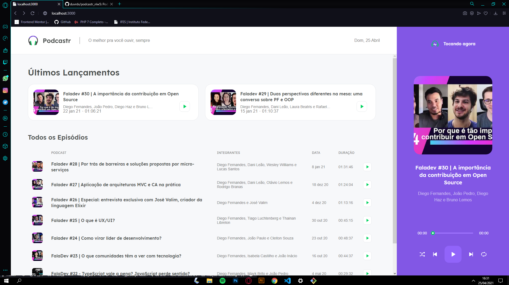
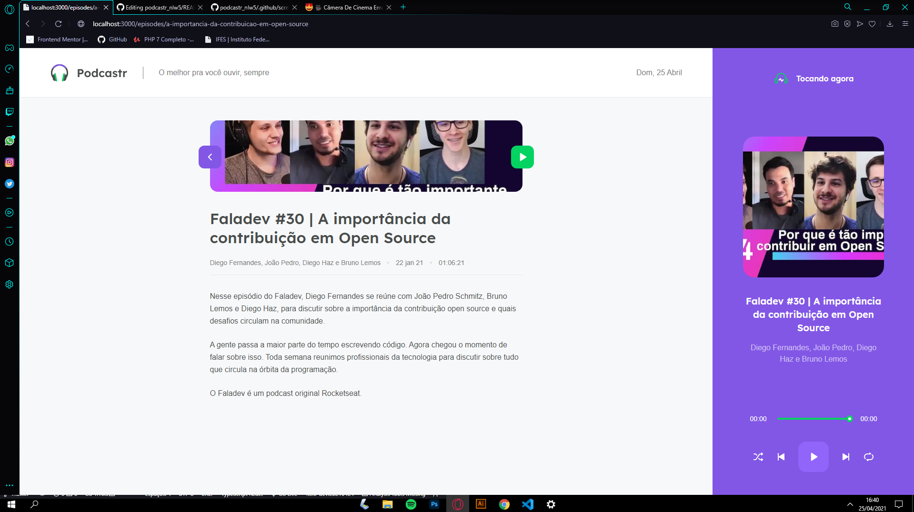
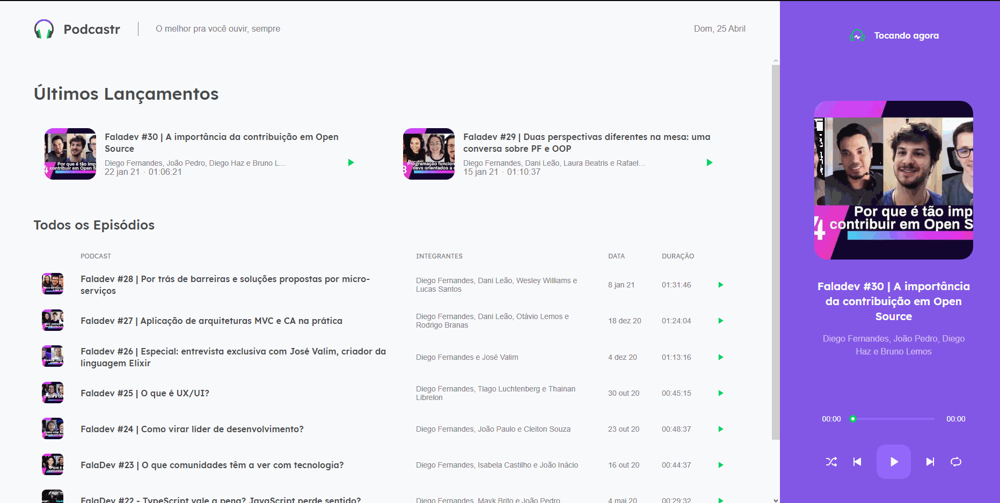

# 🖐 Hi there!

This is a repository made at Rocketseat's Next Level Week event, where we learn and practice technologies such as: ReactJS, NextJS, Node.js, Typescript and SASS.

This repository is for study purposes only, the entire creative and didactic part is the right of the Rocketseat team.


# :computer: Technologies
This project was made using the follow technologies:

* [Typescript](https://www.typescriptlang.org/)      
* [React](https://reactjs.org/)      
* [Next.js](https://nextjs.org/)      

# 🎥 Screnshots & Screen Recording

```
Homepage
```
<div>
     
</div>

```
Homepage
```
<div>
     
</div>

```
Demo
```
<div>
     
</div>

# :construction_worker: How to run

```bash
# Clone Repository
$ git clone https://github.com/duvrdx/podcastr_nlw5.git
```

### 💻 Run Web Project

```bash
# Install Dependencies
$ npm install

# Run Server
$ npm run server

# Run Aplication
$ npm run dev
```
Go to http://localhost:3000/ to see the result.


Give a ⭐️ if you liked that project!
